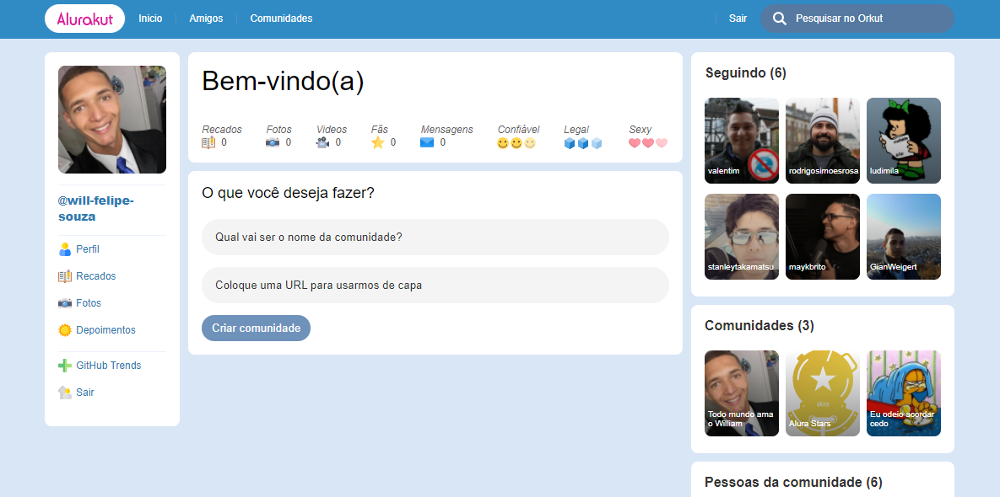

<h1 align="center">
  
</h1>

<p align="center">
  <a href="#-tecnologias">Tecnologias</a>&nbsp;&nbsp;&nbsp;|&nbsp;&nbsp;&nbsp;
  <a href="#-projeto">Projeto</a>&nbsp;&nbsp;&nbsp;|&nbsp;&nbsp;&nbsp;
  <a href="#-incremento">Incremento</a>&nbsp;&nbsp;&nbsp;|&nbsp;&nbsp;&nbsp;
  <a href="#-incremento">Execução</a>&nbsp;&nbsp;&nbsp;
</p>

<br>

<p align="center">
  
</p>

## 🚀 Tecnologias

Esse projeto foi desenvolvido com as seguintes tecnologias:

- HTML
- CSS
- JavaScript
- ReactJS
- NextJS
- DatoCMS

## 💻 Projeto

O projeto foi desenvolvido na semana de imersão ReactJS da Alura, relembrando a antiga rede social Orkut, com suas comunidades. Consumimos APIs do Github e do DatoCMS, onde salvamos os dados das comunidades criadas. Para acessar o projeto na web [clique aqui](https://alurakut-will-souza.vercel.app/), logo após insira seu usuário do GitHub.

## 🚀 Incremento

Atualizei a página Index para a página de login. 
Inseri a regra de exibição dos "Seguindo", para que exiba apenas seis perfis.

## 🚀 Execução 

No terminal instale os pacotes necessários:
```
yarn install
```
Logo em seguida rode o comando abaixo para executar em modo dev:
```
yarn dev
```

---

Feito com 💜 👋 [Check out my LinkedIn](https://www.linkedin.com/in/william-souza-0967337b/)